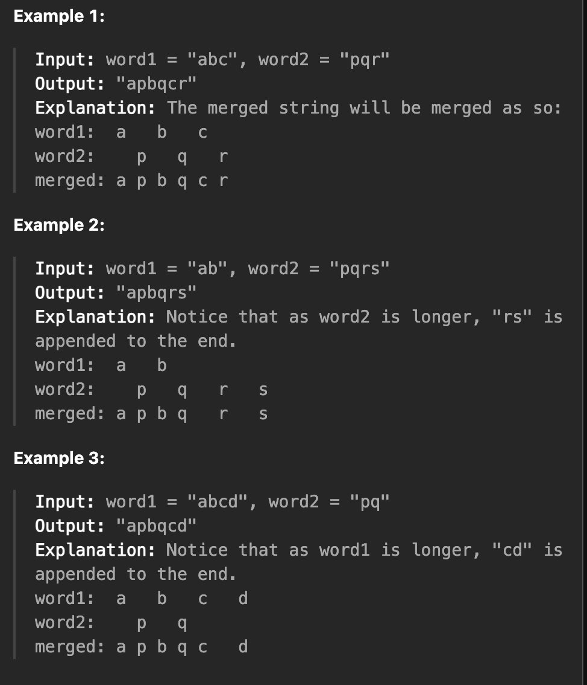

## Description:
[Leetcode 1768: Find the Index of the First Occurrence in a String](https://leetcode.cn/problems/merge-strings-alternately/description/?envType=study-plan-v2&envId=programming-skills)

<!--  -->

## 一、这道题在干嘛（一句话）

给两个字符串，从左到右轮流拿字符拼起来；
如果有一个先用完，就把剩下的直接接在后面。


## 二、我一开始是怎么想的（最普通的想法）

我的第一反应是：

1️⃣ 先找两个字符串**都能用的长度**
2️⃣ 把这一段**一一交替拼起来**
3️⃣ 如果有一个更长，把**剩下的尾巴直接接上**

👉 这个思路很好理解，但要注意「等长」也是一种情况，不能漏。


## 三、解法一：先拼共同部分，再接尾巴（分类思路）

### 人话理解

* 前面一段：两个字符串都有 → 一定可以交替拼
* 后面一段：只有一个字符串还有 → 直接接

### 写代码时要注意的点

* **一定要给结果一个默认值**（等长时直接返回）
* `if / elif` 要覆盖所有情况
* 尾巴直接用 `word[equal:]`，比负索引清楚

### 易错点

- 忘了 `len(word1) == len(word2)`
- `result` 只在 if 里赋值，等长时会炸
- 一些关于字符串的拼接问题还有代码书写的简化


## 四、解法二：双指针（把分类讨论“拆碎”）
> **也就是说是分类讨论的思想转换成状态，每一步的措施，然后需要循环多少步，其中需要循环的次数就是while，同时注意判断边界**

### 人话理解（我现在更喜欢这个）

不用管谁长谁短，只关心：

> **“现在这个位置，还有没有字符可以拿？”**

* 有就拿
* 没有就跳过
* 一直循环，直到两个都没了

### 为什么这个思路稳

* 不用比较长度
* 不存在漏情况
* 等长 / 不等长都自动覆盖

### 我的代码对应的想法

```text
只要 word1 或 word2 还有字符：
    如果 word1 还能拿 → 拿一个
    如果 word2 还能拿 → 拿一个
```

> 👉 这是把「分类讨论」拆成每一步的小判断


## 五、解法三：用 zip_longest（工具帮我对齐）

### 人话理解

* `zip_longest` 会把两个字符串强行拉成一样长
* 短的那边会用 `None`（或者我指定的值）补齐
* 我只负责把“真的字符”放进结果

### 为什么一定要写 `if x`

因为：

* `zip_longest` 会产生 `None`
* `None` 不能 join
* 所以 **拿之前必须过滤**

### 更稳的写法（我以后用这个）

```python
if x is not None:
    ans.append(x)
```

或者直接：

```python
zip_longest(word1, word2, fillvalue="")
```

这样就不用写 if 了。


## 六、三种解法怎么选（我自己的结论）

| 解法          | 什么时候用                |
| ----------- | -------------------- |
| 共同部分 + 尾巴   | 想法最直观，刚学时            |
| 双指针         | **最稳、最不容易错，面试/刷题首选** |
| zip_longest | 想写得短，或者熟悉 Python 工具时 |


## 七、这道题我真正学到的几个点（重点）

### 1️⃣ if 写完一定要问一句

> 有没有一种合法情况，代码根本没走进任何分支？

如果有，就说明会炸。


### 2️⃣ 能不整体分类，就别整体分类

* 整体分类：谁长谁短（容易漏）
* 状态判断：现在还能不能拿（稳）


### 3️⃣ 用工具要知道它“偷偷帮我干了什么”

* `zip_longest` 会补 `None`
* 所以我要么过滤，要么改 `fillvalue`


## 八、总结

> **这道题不难，难的是：
> 别在一开始就把情况分死，
> 能在循环里慢慢判断的，就别提前分类。**


